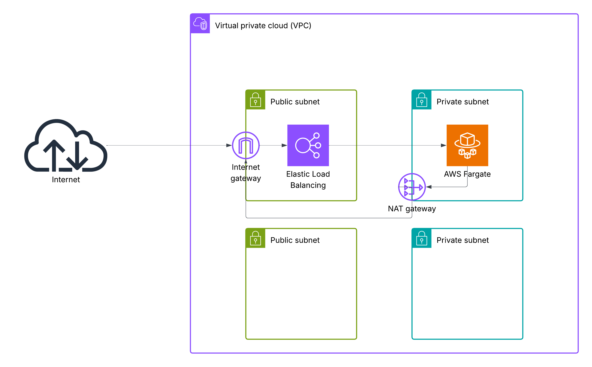

# AWS ECS NGINX Webserver - Elastic Load Balancer - Example

## Contents:
- A new VPC, with 4 subnets (2 private, 2 public)
- An Internet Gateway, an NAT Gateway (for AWS API connectivity, can be replaced with VPCes)
- An Elastic Load Balancer placed in one public subnet
- An ECS container running NGINX deployed in a private subnet

## Architecture Diagram
